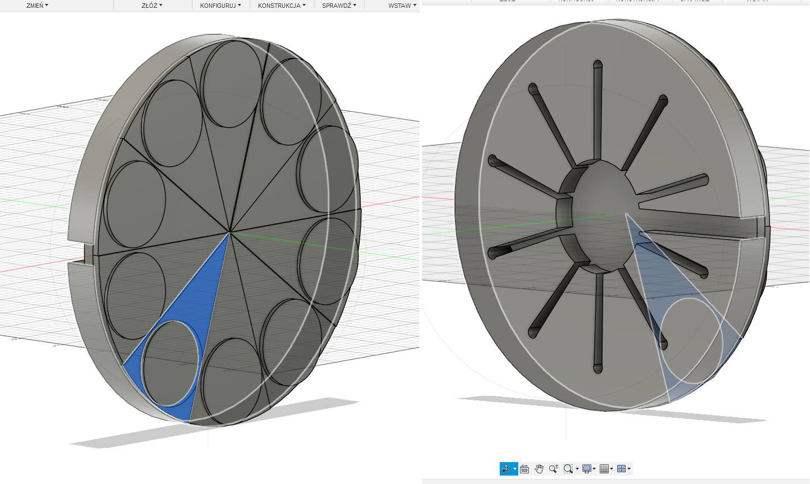
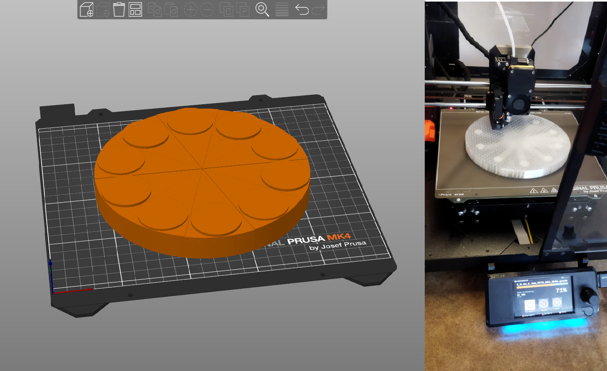
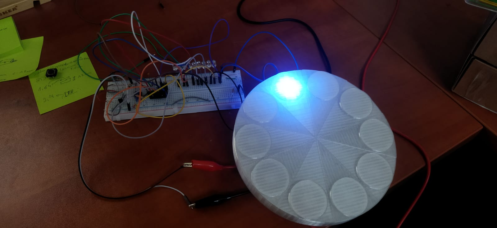

# electronic_roulette
### Short description
Electronic roulette based on analog integrated circuits NE555 and CD4017.

# Model

At first I planned what the main 'scene' of roulette should look like. Of course, this is not an ordinary roulette, it is intended for predicting which glass to drink from.
It was easy to determine for 10 glasses: 360°/10 = 36° for each glass. Then just centering a circle slightly wider than the diameter of the glass.

 

I printed the board for the glasses using Prusament PETG Clear filament. This allowed the light from the rouette to better illuminate the drawn glass.

# First tests

First test attempt at mounting the LED diode and lighting it up from a working roulette wheel. It looks great, and the roulette wheel just happened to land on the LED diode I placed in the board.

