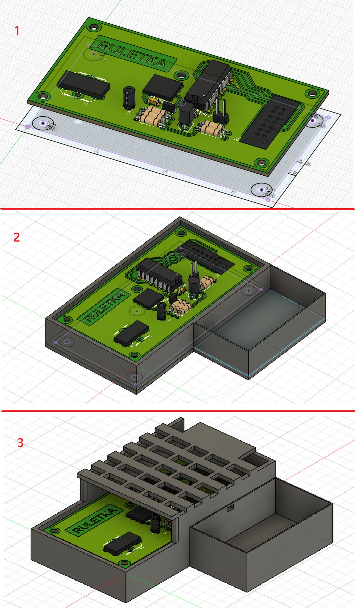
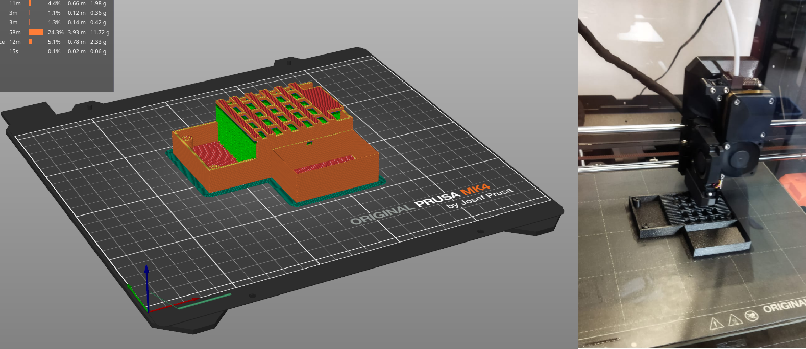
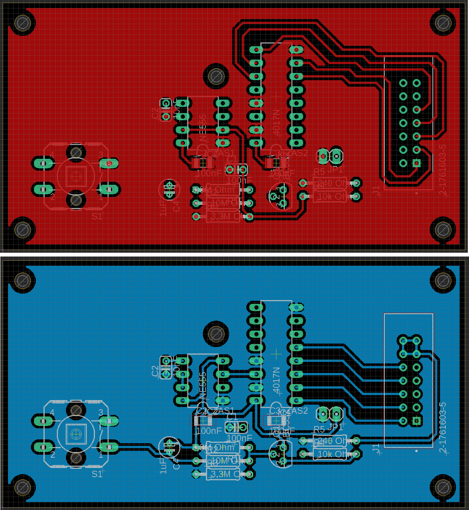
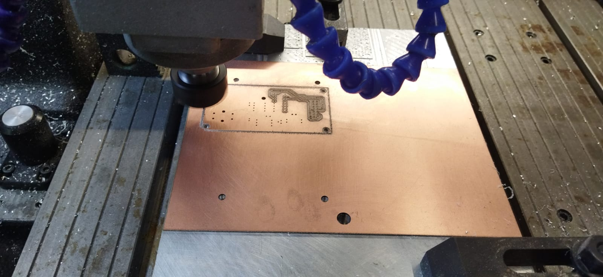
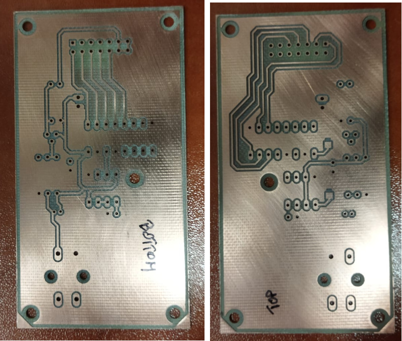
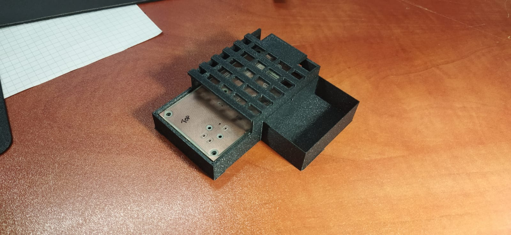

# electronic_roulette
### Short description
Electronic roulette based on analog integrated circuits NE555 and CD4017.

The idea of ​​implementing an electronic roulette was born from a ready-made project of a circuit presented at: https://www.555-timer-circuits.com/roulette.html

### To~Do List

- [x] create a board measuring 200 mm x 200 m with the option to accommodate 38 mm glasses.
- [x] print the board
- [x] Create a prototype of an electronic roulette wheel on a breadboard [Malfunction](#no-filtration-no-peace)
- [x] Design PCB
- [x] Produce PCB
- [ ] Solder the PCB and check its operation
- [x] Create a PCB case and print it
- [ ] Testing ;_;
- [ ] Done

# Model

At first I planned what the main 'scene' of roulette should look like. Of course, this is not an ordinary roulette, it is intended for predicting which glass to drink from.
It was easy to determine for 10 glasses: 360°/10 = 36° for each glass. Then just centering a circle slightly wider than the diameter of the glass.

 

I printed the board for the glasses using Prusament PETG Clear filament. This allowed the light from the rouette to better illuminate the drawn glass.

# First tests

First test attempt at mounting the LED diode and lighting it up from a working roulette wheel. It looks great, and the roulette wheel just happened to land on the LED diode I placed in the board.

Unfortunately, I miscounted the holes for the LEDs and they will need to be drilled out a bit depending on the diameter of the LED that will be used (mine were 5.5 mm and 6.0 mm).

I am making the .stl model of this shot glass roulette board available under the Creative Commons 4.0 BY license.

You can find the model in the prusa3D folder, file named "roulette v5.stl" or just click the [link](prusa3D/ruletka%20v5.stl)

## No filtration, no peace

During the assembly of the entire electronic circuit, various errors occurred: from no operation, to operation at a lower voltage and even every other LED (only 5 out of ten) lighting up, interestingly every other one was perfect.

I added a 100nF ceramic capacitor to each integrated circuit near the power supply pins and the problem was solved.

# Control unit case

The case provides space for the electronics and a 9V battery. Due to the lack of a power switch for the electronics, the battery is exposed so that it can be connected and disconnected efficiently.

For printing, you need to use all possible supports offered by PrusaSlicer. For better flexibility, I used Prusament PLA Galaxy Black filament.

# PCB Manufacturing

For PCB design I currently use the indestructible and best in class Eagle PCB. I created two layers of tracks, without vias to facilitate the assembly and milling process.

The board is designed so that the line transmitting the clock from the NE555 is as short as possible. I connected the unused pin 5 in the NE555 with a 10nF capacitor to GND. I added (as I wrote earlier) a 100nF ceramic capacitor between Vdd and Vss (between +9V and GND) to each circuit. In order not to add too many components, I decided to design them as SMT-mounted components.

A button to start the roulette is protruding from the front. I designed a small hole for the wires to the 9V battery and a hole at the back for the cable harness to the round roulette field (I will probably have to cut it out because the ribbon cable plug will not fit anyway)

One of the methods I have developed for making simple double-sided PCBs is milling copper laminates on a CNC milling machine.

I use FlatCAM to create the gerber program.

First, in Eagle PCB I export (generate) CAM Data.

In FlatCAM, to position the PCB for milling on both sides, I used positioning points (4 small holes 4mm).

Thanks to the built-in tools in FlatCAM PCB, it was possible to mill in 1:1 reflection - the other side did not move after rotating it relative to the holes. 

This is what a bare board looks like in a ready-made housing for control electronics.

